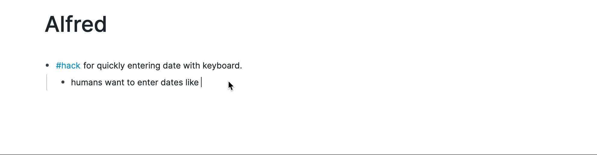
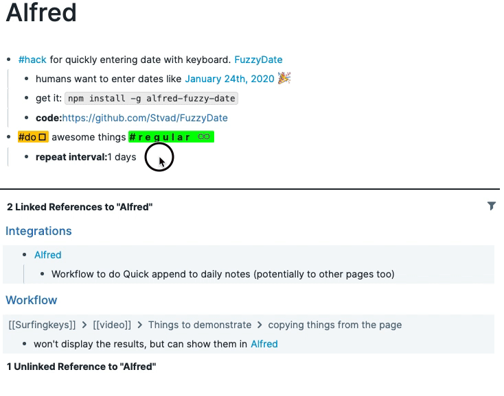

# alfred-fuzzy-date

[Alfred](https://www.alfredapp.com/) workflow to convert human date to computer date.  
Made for use with http://roamresearch.com/

Trigger via `fd` keyword (or shortcut that you can set in Alfred settings)

### Use cases:
* Parse fuzzy date - just enter the date.
* If you want to get a repeated sequence of dates - enter the increment and then number of repeats after the `;`. Example: `1 week;4` would yield 4 dates starting a week from now and ending 5 weeks into the future

### Configurations
* If you just want to copy the result without pasting it into the frontmost application - hold `Cmd`.
* You can configure precise format of the output in the workflow environment variables.

## Installation

`npm install -g alfred-fuzzy-date`

